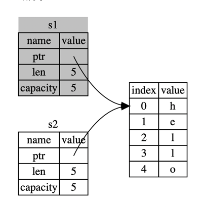
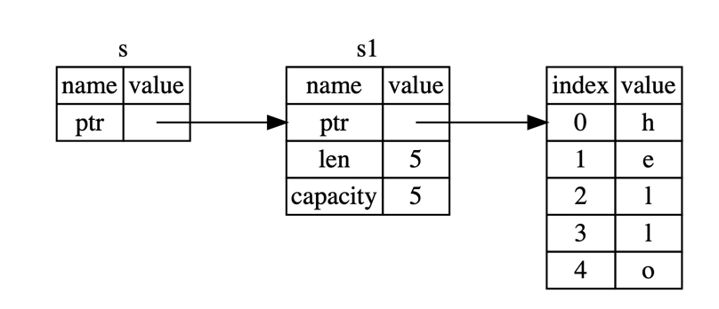
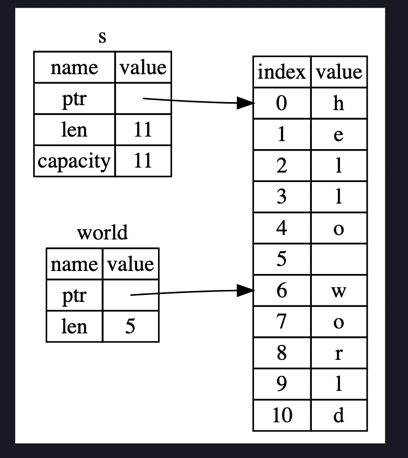

# rust语法
## 常见概念
### 变量与可变性
rust中变量默认是不可变的。一旦对变量进行赋值，就不能进行第二次赋值。  
但是允许通过关键词**mut**使其可以改变。例如：  
````rust
fn main() {
    //变量的声明
    let mut x = 5;
    println!("The value of x is: {}", x);
    x = 6;
    println!("The value of x is: {}", x);
    //显示的变量声明
}
````
此时肯定会有人问变量和常量有什么区别吗？        
变量是一般不允许改变，常量是永远不可变且不能使用**mut**关键词  
**常量**使用关键词**const**且必须注明值的类型。  
**变量名称**可以重复声明且可以改变数据类型，当名称重复声明的时候，前一个变量将被隐藏  

### 数据类型（标量和符合类型）
rust属于静态类型语言，在编译时必须明确变量的类型，当存在多种可能性时，必须声明类型注解
此时介绍的数据类型都是存储在栈上的并且当离开作用域时被移出栈  
#### 标量
**整型**（默认 i32）

    | 长度     |  有符号  |   无符号  |
    |---------|---------|----------|
    | 8-bit   | `i8`    | `u8`     |    
    | 16-bit  | `i16`   | `u16`    |
    | 32-bit  | `i32`   | `u32`    |
    | 64-bit  | `i64`   | `u64`    |
    | 128-bit | `i128`  | `u128`   |
    | arch    | `isize` | `usize`  |

    isize 和 usize 类型依赖运行程序的计算机架构：64 位架构上它们是 64 位的， 32 位架构上它们是 32 位的

Rust 中的整型字面值

    |     数字字面值     |      例子     |
    |------------------|---------------|
    | Decimal          | `98_222`      |
    | Hex              | `0xff`        |
    | Octal            | `0o77`        |
    | Binary           | `0b1111_0000` |
    | Byte (`u8` only) | `b'A'`        |
    
    除了byte 以外的所有数字字面值允许使用类型后缀，例如 57u8，同时也允许使用 _ 做为分隔符以方便读数，例如1_000

**浮点型**分为**f32**和**f64（默认）**  
**数值运算**  
````rust
fn main() {
    // 加法
    let sum = 5 + 10;

    // 减法
    let difference = 95.5 - 4.3;

    // 乘法
    let product = 4 * 30;

    // 除法
    let quotient = 56.7 / 32.2;

    // 取余
    let remainder = 43 % 5;
}
````
**布尔型**
````rust
fn main() {
    let t = true;

    let f: bool = false; // 显式指定类型注解
}
````
**字符类型** char 由单引号指定，不同于字符串使用双引号
````rust
fn main() {
    let c: char = 'z';
    let z = 'ℤ';
    let heart_eyed_cat = '😻';
}
````
char 类型的大小为四个字节(four bytes)，并代表了一个 Unicode 标量值。拼音字母（Accented letters），中文、日文、韩文等字符，emoji（绘文字）以及零长度的空白字符都是有效的 char 值。  
Unicode 标量值包含从 U+0000 到 U+D7FF 和 U+E000 到 U+10FFFF 在内的值  
#### 复合类型（元组和数组）
**元组**是一个将多个其他类型的值组合进一个复合类型的主要方式。元组长度固定：一旦声明，其长度不会增大或缩小。  
````rust
fn main() {
    //声明
    let tup: (i32, f64, u8) = (500, 6.4, 1);
    
    //使用模式匹配来解构
    //使用了 let 和一个模式将 tup 分成了三个不同的变量，x、y 和 z。这叫做 解构
    let (x, y, z) = tup;
    println!("The value of y is: {}", y);
    
    //使用点号（.）后跟值的索引来直接访问它们（元组的第一个索引值是 0）
    let five_hundred = tup.0;
    let six_point_four = tup.1;
    let one = tup.2;
    
}
````
**数组**中的每个元素的类型必须相同。Rust 中的数组是固定长度的：一旦声明，它们的长度不能增长或缩小。  
数组在栈（stack）而不是在堆（heap）上为数据分配空间  
````rust
fn main() {
    //声明
    let a = [1, 2, 3, 4, 5];
    // 声明 在方括号中包含每个元素的类型，后跟分号，再后跟数组元素的数量。
    let a: [i32; 5] = [1, 2, 3, 4, 5];
    // 如果要为每个元素创建包含相同值的数组，可以指定初始值，后跟分号，然后在方括号中指定数组的长度
    let a = [3; 5];
    // 等同于 let a = [3, 3, 3, 3, 3];
    
    //访问
    let first = a[0];
    println!("The value of first is: {}", first);
}
````
### 函数 
Rust 代码中的函数和变量名使用 snake case 规范风格。在 snake case 中，所有字母都是小写并使用下划线分隔单词。  
使用**fn**关键字加函数名定义函数。 main 函数，它是很多程序的入口点  
可以使用函数名后跟圆括号来调用我们定义过的任意函数。rust 不关心函数定义的顺序，只要定义了就行  
````rust
fn main() {
    println!("Hello, world!");

    another_function();
    another_with_param_function(5);
}

fn another_function() {
    println!("Another function.");
}

fn another_with_param_function(x: i32) {
    println!("The value of x is: {}", x);
}
````
**函数体**是由一系列语句和可选的结尾表达式构成的  
**语句**是执行一些操作但不返回值的指令  
**表达式**计算并产生一个值  
表达式的结尾没有分号。如果在表达式的结尾加上分号，它就变成了语句，而语句不会返回值  
```rust
fn main() {
    //let x = (let y = 6);
    //是错误的，rust中赋值语句没有返回值
    
    //表达式可以是语句的一部分 5就是一个表达式
    let x = 5;
    //{}也是一个表达式
    let y = {
        let x = 3;
        //表达式的结尾没有分号
        x + 1
    };
    //x为5
    println!("The value of x is: {}", x);
    //y为4
    println!("The value of y is: {}", y);
    
    let a = five();
    println!("The value of a is: {}", a);
}

fn five() -> i32 {
    //不能加分号，加了是语句没有返回值，会报错
    5
}
```
#### 注释
rust中使用`//`，注释本行的。也可以在放在包含代码的行的末尾  

#### 控制流
**if / if else** 表达式允许根据条件执行不同的代码分支。且不同分支的返回值类型必须一致  
```rust
fn main() {
    let number = 6;

    if number % 4 == 0 {
        println!("number is divisible by 4");
    } else if number % 3 == 0 {
        println!("number is divisible by 3");
    } else if number % 2 == 0 {
        println!("number is divisible by 2");
    } else {
        println!("number is not divisible by 4, 3, or 2");
    }
    
    //let中也可以使用if
    let number = if condition {
        5
    } else {
        6
    };
    println!("The value of number is: {}", number);
    
}
```
**循环**一个循环执行循环体中的代码直到结尾并紧接着回到开头继续执行。Rust 有三种循环：loop、while 和 for  
**loop** 使用`break` 结束循环
```rust
fn main() {
    let mut counter = 0;

    let result = loop {
        counter += 1;

        if counter == 10 {
            break counter * 2;
        }
    };
    println!("The result is {}", result);
}
```
**while** 条件循环  
```rust
fn main() {
    let a = [10, 20, 30, 40, 50];
    let mut index = 0;

    while index < 5 {
        println!("the value is: {}", a[index]);

        index = index + 1;
    }
}
```
**for**循环遍历  
如上代码段，while 也可以进行遍历，但是很容易出错，如果索引长度不正确会导致程序 panic。这也使程序更慢，因为编译器增加了运行时代码来对每次循环的每个元素进行条件检查。  
```rust
fn main() {
    let a = [10, 20, 30, 40, 50];

    for element in a.iter() {
        println!("the value is: {}", element);
    }
    //大部分 Rustacean 也会使用 for 循环。这么做的方式是使用 Range，它是标准库提供的类型，用来生成从一个数字开始到另一个数字之前结束的所有数字的序列
    //使用 for 循环来倒计时的例子, rev，用来反转 range
    for number in (1..4).rev() {
        println!("{}!", number);
    }
    println!("LIFTOFF!!!");
}
```

## 所有权
所有权（系统）是 Rust 最为与众不同的特性，它让 Rust 无需垃圾回收（garbage collector）即可保障内存安全。理解 Rust 中所有权如何工作是十分重要的。它包括借用，slice，以及rust如何在内存中分布。  
**内存管理方式**：所有的计算机语言，都必须管理其使用的内存使用方式。目前所知的有：
1. 垃圾回收机制。在程序运行时不断地寻找不再使用的内存
2. 程序员必须亲自分配和释放内存
3. 所有权系统（rust独有）。编译器在编译时会根据一系列的规则进行检查。在运行时，所有权系统的任何功能都不会减慢程序

**所有权规则**
    
    1.Rust 中的每一个值都有一个被称为其 所有者（owner）的变量。
    2.值在任一时刻有且只有一个所有者
    3.当所有者（变量）离开作用域，这个值将被丢弃。
   
    
### 堆和栈
栈和堆都是代码在运行时可供使用的内存，但是它们的结构不同。  
栈以放入值的顺序存储值并以相反顺序取出值。后进先出原则。栈中的所有数据都必须占用已知且固定的大小。  
在编译时大小未知或大小可能变化的数据，要改为存储在堆上，堆是缺乏组织的：当向堆放入数据时，你要请求一定大小的空间。操作系统在堆的某处找到一块足够大的空位，把它标记为已使用，并返回一个表示该位置地址的 指针（pointer）。被称为堆上分配内存。  

### 作用域
作用域是一个项（item）在程序中有效的范围。  
```rust
fn main() {
    {                       // s 在这里无效, 它尚未声明
        let s = "hello";    // 从此处起，s 是有效的
        //使用s
    }                       // 此作用域已结束，s 不再有效

    let s = "hello";                    //字符串字面值，不可变
    let s = String::from("hello");      //String类型，被分配到堆上
    let mut s = String::from("hello");
    s.push_str(", world!"); // push_str() 在字符串后追加字面值
    println!("{}", s); // 将打印 `hello, world!`
    
    //这时肯定有人就想，我给let s = "hello";加mut关键词不行吗，
    //答，不行。
    //报错， no method named `push_str` found for reference `&str` in the current scope。
    
}
```
### 内存与分配
上面两种不同的结果是有依据的，就字符串字面值来说，我们在编译时就知道其内容，所以文本被直接硬编码进最终的可执行文件中。这使得字符串字面值快速且高效。  
对于 String 类型，为了支持一个可变，可增长的文本片段，需要在堆上分配一块在编译时未知大小的内存来存放内容。这就意味着：  

    1.必须在运行时向操作系统请求内存。
    2.需要一个当我们处理完 String 时将内存返回给操作系统的方法。
第一部分我们在调用`String::from`时就已经向操作系统请求了内存。  
第二部分不同的语言有不同的方式，有的是垃圾回收机制（GC），有的是手动销毁，返还内存。在Rust中，当拥有内存的变量在离开作用域后会自动调用`drop`函数以回收内存。  

**变量与数据交互的方式（一）：移动**
数据放在堆上的变量，在使用=的时候是进行的移动，会使前一个数据不可用。
```rust
fn main() {
    let s1 = String::from("hello");
    let s2 = s1;
    println!("{}, world!", s1); //是错误的，因为所有权移动。s1已经被销毁
}
```

**变量与数据交互的方式（一）：克隆**
数据存放在堆上变量，可以是用`clone`通用函数实现克隆，而不会销毁前一个变量。
```rust
fn mian() {
    let s1 = String::from("hello");
    let s2 = s1.clone();

    println!("s1 = {}, s2 = {}", s1, s2);
}
```

**所有权与函数**将数据传递给函数和变量赋值一样，都会转移所有权
**返回值与所有权**返回值也可以转移所有权。

### 引用和借用
使用`&`关键字的变量，将创建它的引用，且不会转移所有权，同样的也不支持修改变量内容。  使用`*`解引用。  
```rust
fn main() {
    let s1 = String::from("hello");

    let len = calculate_length(&s1);

    println!("The length of '{}' is {}.", s1, len);
}

fn calculate_length(s: &String) -> usize {
    s.len()
}
```

**借用**是获取引用作为函数参数。
当我们想修改引用的值同时又不想造成所有权的转移时，应该怎么办，这时就有了**可变引用**。但是在特定作用域中的特定数据只能有一个可变引用。是为了避免数据竞争的发生。 同一作用域不可变引用和可变引用不能同时存在。  

    1.两个或更多指针同时访问同一数据
    2.至少有一个指针被用来写入数据
    3.没有同步数据访问的机制

```rust
fn main() {
    let mut s = String::from("hello");

    change(&mut s);
}

fn change(some_string: &mut String) {
    some_string.push_str(", world");
}
```
**悬垂引用**在具有指针的语言中，很容易通过释放内存时保留指向它的指针而错误地生成一个 悬垂指针。谓悬垂指针是其指向的内存可能已经被分配给其它持有者。但是在rust中不会有这种情况。  
```rust
fn main() {
    //错误
    let reference_to_nothing = dangle();
}

fn dangle() -> &String {
    let s = String::from("hello");

    &s
}// 这里 s 离开作用域并被丢弃。其内存被释放。
```
引用的规则：

    1.在任意给定时间，要么 只能有一个可变引用，要么 只能有多个不可变引用。
    2.引用必须总是有效的。

### Slice(没有所有权)
**slice**允许你引用集合中一段连续的元素序列。
**字符串 slice**是 String 中一部分值的引用。
可以使用一个由中括号中的 [starting_index..ending_index] 指定的 range 创建一个 slice，其中 starting_index 是 slice 的第一个位置，ending_index 则是 slice 最后一个位置的后一个值。  
字符串 slice range 的索引必须位于有效的 UTF-8 字符边界内，如果尝试从一个多字节字符的中间位置创建字符串 slice，则程序将会因错误而退出。

```rust
fn main() {
    let s = String::from("hello world");

    let hello = &s[0..5];
    let world = &s[6..11];

    //可以进行适当的省略
    let slice = &s[0..2];
    let slice = &s[..2];

    let len = s.len();
    let slice = &s[3..len];
    let slice = &s[3..];

    let word = first_word(&s);
    s.clean();//错误的，clear 需要清空 String，它尝试获取一个可变引用。但是已经有了一个不可变引用
}

fn first_word(s: &String) -> &str {
    let bytes = s.as_bytes();

    for (i, &item) in bytes.iter().enumerate() {
        if item == b' ' {
            return &s[0..i];
        }
    }

    &s[..]
}
```
内存图如下


字符串的字面值就是一个slice，属于不可变引用。  

